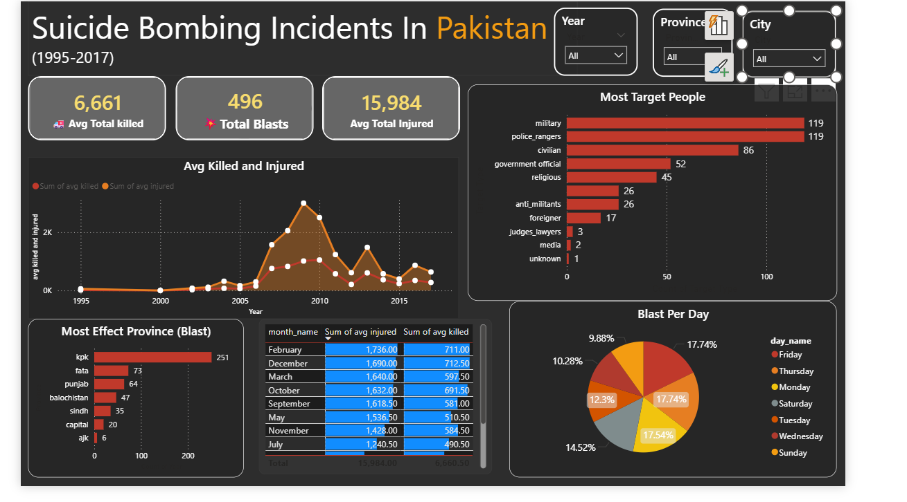
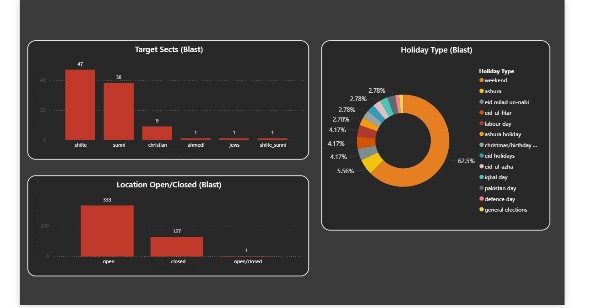
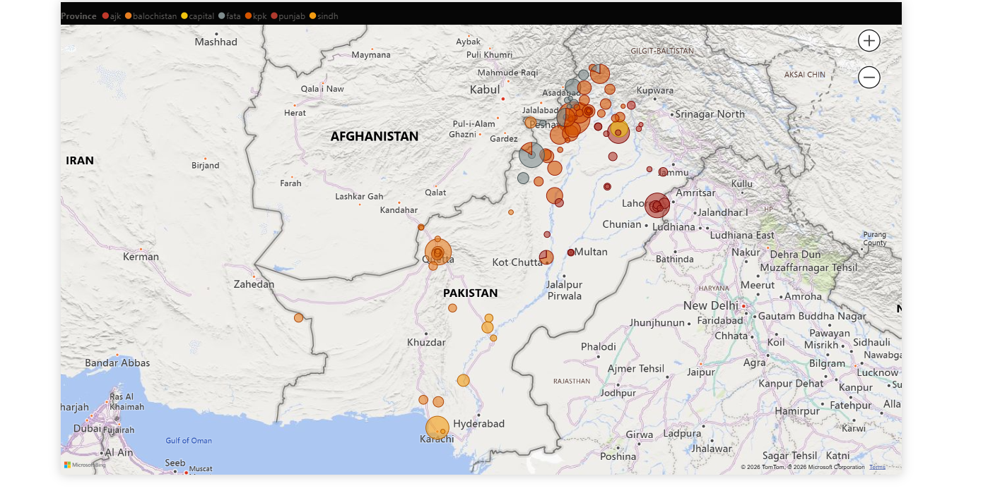

---

# Suicide Bombing Incidents in Pakistan (1995-2017) | Power BI Analytics

## 📌 Project Overview
This project provides a comprehensive spatio-temporal analysis of suicide bombing incidents in Pakistan over a 22-year period. Utilizing Power BI, the dashboard transforms raw historical data into actionable insights, highlighting trends in casualties, high-risk geographical zones, targeted demographics, and seasonal patterns.

The goal of this analysis is to provide a clear visual narrative of the impact of terrorism, aiding in the understanding of security challenges through data.

## 📊 Key Insights
* **Casualty Impact:** Over **6,661 lives lost** and **15,984 injuries** recorded across 496 blast incidents.
* **Geographical Hotspots:** Khyber Pakhtunkhwa (KPK) and FATA emerged as the most affected regions, significantly higher than other provinces.
* **Target Analysis:** Military and Police personnel are the most frequent targets (119 incidents each), followed closely by civilian populations.
* **Temporal Trends:** Data shows a significant surge in activity between **2007 and 2013**, peaking around 2009.
* **Temporal Patterns:** Friday is the most frequent day for attacks (17.74%), often coinciding with public gatherings.

## 🖥️ Dashboard Showcase

### Power BI Interactive Dashboard
Below are the static snapshots of the multi-page analytical report.

#### 1. Overview & Impact Analysis
Focuses on total casualties, yearly trends, and primary targets.

#### 2. Categorical & Demographic Trends
Breakdown of targets by sect, location type (Open vs. Closed), and occurrence during holidays.

#### 3. Geospatial Mapping
A detailed map view showing the density and scale of incidents across Pakistan's borders and cities.

---

### 🎥 Dashboard Demonstration

> *Watch the interactive walkthrough of the dashboard to see how filters for Year, Province, and City impact the data visualization.*

---

## 🛠️ Tools & Technologies Used
* **Power BI Desktop:** For data modeling, DAX calculations, and visualization.
* **Microsoft Excel / CSV:** Data source containing incident logs from 1995-2017.
* **Power Query:** For data cleaning, handling null values, and date formatting.

## 📖 Features of the Dashboard
-   **Dynamic Filtering:** Slicers for Year, Province, and City for granular data exploration.
-   **Time-Series Analysis:** Line charts showcasing the "Avg Killed vs. Injured" over two decades.
-   **Target Profiling:** Bar charts identifying "Most Target People" and "Target Sects."
-   **Operational Insights:** Donut charts illustrating "Blast Per Day" and "Holiday Type" correlations.
-   **Spatial Intelligence:** Bubble maps representing the magnitude of blasts in various districts.

## 📂 Data Structure
The dataset includes the following key attributes:
* `Date/Year`: Timeline of the incident.
* `Location`: City and Province coordinates.
* `Casualties`: Number of killed and injured.
* `Target Type`: Professional or sectarian background of the targets.
* `Holiday Type`: Indicates if the blast occurred on a specific national or religious holiday.

## 🚀 How to Use
1.  Clone this repository.
2.  Install [Power BI Desktop](https://powerbi.microsoft.com/desktop/).
3.  Open the `.pbix` file (if included) to interact with the model.
4.  Alternatively, refer to the `dashbord_power_bi_1.png` files for quick insights.

---

## ⚖️ Disclaimer
*This project is for educational and analytical purposes only. The data used is historical and intended to foster an understanding of data visualization in the context of humanitarian and security studies.*

## 🤝 Contact
Your Name - [Kamran Orakzai]
